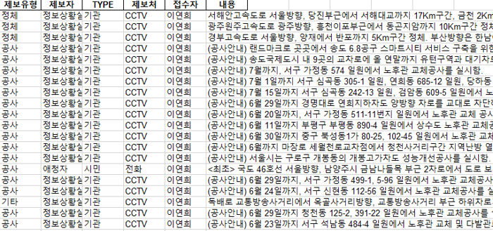
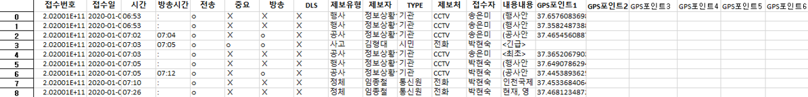

# incheon-traffic-event-data

인청경인교통방송 접수 데이터로부터 좌표를 추출하여 데이터 적재  
- 접수 데이터에는 좌표가 존재하지않아 내용을 통해 좌표를 수작업으로 추출
    - 우리나라 특정 지역의 좌표를 추출하기 위한 web server 구축
- raw data와 추출한  좌표 데이터를 Accumulo에 적재

## 개발 환경
- node.js (ver )
- Python (ver 3.x)

## data
- 경인교통방송 제보데이터 (원 데이터, 전처리 후 데이터)  


## web-server
- Kakao Maps API의 Javascript API를 사용하기 위한 서버 구축
- Node.js의 express-generator 모듈을 사용

## result
- 인청경인교통방송 접수 데이터로부터 추출한 좌표 데이터

### code
```
event_data_preprocessing.py
```
Data의 불필요한 부분인 제보유형컬럼의 "원활" 항목과 내용컬럼의 "(안내)" 데이터 제거
```
event_data_insert.py
```
인청경인교통방송 접수 데이터로부터 좌표를 추출하여 accumulo에 저장

## 진행 상황
- Data 전처리 및 불필요한 데이터 삭제 (20.09.17)
- Kakao OPEN API를 이용하여 특정 지역 좌표 얻기 (20.12.20)
    - Kakao Local REST API를 이용하여 주소의 자표 얻기 - 특정 도로 위나 지역의 좌표를 얻기 어려움 (20.09.18)
    - KaKao Maps API의 Javascript API를 사용하기 위해 Node.js를 이용하여 Web 서버 구축 (20.09.23)
    - 웹 서버 여러 명이서 작업해도 문제 없음 확인
    - 좌표 추출을 위한 매뉴얼 생성 
    - 이벤트 테이블 스키마 작성 (20.09.28)
    - 웹서버를 통해 인청경인교통방송 접수 데이터 좌표 추출 작업 수행
- 인청경인교통방송 접수 데이터 좌표 Accumulo에 저장 (20.12.23)
